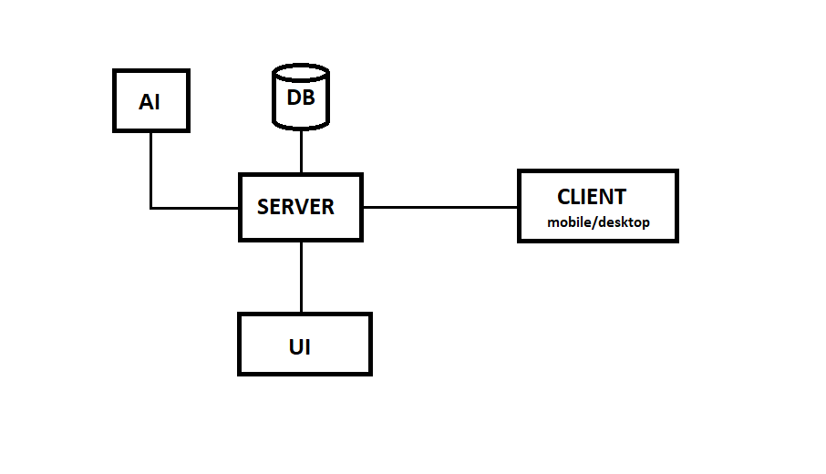

# Distributed application for tracking package deliveries

### Description
A distributed application for tracking package deliveries.

  
<b>Timeline</b>

1. intro, install tools & select project topic!
2. server (java spring)
3. mobile (android) / desktop app (C#)
4. frontend (vue)
5. AI integration / free session
6. free session
7. final presentation

 

  
<b>Key Concepts</b>

- [java, jdk](https://www.scaler.com/topics/java/how-java-program-works/)
- [java Spring, dependency injection](https://docs.spring.io/spring-framework/docs/3.2.x/spring-framework-reference/html/overview.html)

- [API](https://www.postman.com/what-is-an-api/), [API endpoint](https://blog.postman.com/what-is-an-api-endpoint/), [Postman](https://www.geeksforgeeks.org/introduction-postman-api-development/)
- [JSON](https://www.w3schools.com/whatis/whatis_json.asp)
- [HTTP](https://www.geeksforgeeks.org/what-is-http/)
- [Rest](https://www.geeksforgeeks.org/rest-api-introduction/)
- [Get, Post, Put/Patch, Delete](https://restfulapi.net/http-methods/)

- [SQL](https://www.w3schools.com/sql/sql_intro.asp) / [CRUD operations](https://www.freecodecamp.org/news/crud-operations-explained/)
- [ORM](https://www.baeldung.com/cs/object-relational-mapping), [Hibernate](https://medium.com/javarevisited/jpa-vs-hibernate-what-is-the-difference-between-them-0b7f49ad488f), [JDBC, JPA] (https://www.baeldung.com/jpa-vs-jdbc), SpringDataJPA

- optional: [Docker](https://www.simplilearn.com/tutorials/docker-tutorial/getting-started-with-docker)

 

  
<b>Tools</b>

Install following tools:

- [Git client](https://git-scm.com/downloads/win), [setup credentials locally](https://www.geeksforgeeks.org/how-to-set-git-username-and-password-in-gitbash/)
- [jdk](https://www.oracle.com/java/technologies/downloads), [mvn](https://maven.apache.org/download.cgi), [Intellij community edition](https://www.jetbrains.com/idea/download)
- [Postman](https://www.postman.com/downloads/)
- [Mysql installer](https://dev.mysql.com/downloads/installer/): install Mysql workbench, Mysql server, jdbc(JConnector)

Check installation in cmd:
- `git --version`
- `java --version`
- `mvn --version`

Other tools and libraries:
- spring project initializer: https://start.spring.io/
- [lombok](https://www.baeldung.com/intro-to-project-lombok)
- [vue](https://www.baeldung.com/spring-boot-vue-js)
- optional: [Docker](https://spring.io/guides/gs/spring-boot-docker)

 

  
<b>Frontend setup: vue+vuetify</b>

1. check - backend ready
2. create `config/WebConfig.java` with given contents
3. in cmd: `npm install -g @vue/cli`
4. in cmd: `vue create packagetracking-frontend` -> select vue3, yarn (or npm)
5. in cmd: `cd packagetracking-frontend` ; `yarn add axios` (or `npm init -y` ; `npm install axios`)
6. in cmd: `vue add vuetify`, select Vuetify 3 - Vue CLI (preview)
7. add a .vue component, import it in app.vue
8. add `{"vue/multi-word-component-names": "off"}` to `eslintConfig.rules` in `package.json`
9. run backend, then in cmd: `yarn run serve` (or `npm run serve`)

Check the <a href="https://vuetifyjs.com/en/components/explorer/">Vue components documentation</a>!

 

  
<b>AI integration</b>

1. install Ollama locally: https://ollama.com/download
2. start Ollama UI locally
3. in Ollama UI, download any model (~1GB)
4. set the model name in `ChatbotService.ollamaModel`
5. rerun backend

 

### Project requirements
- Database:
  - minim 3 tabele cu cel putin 3 coloane fiecare
  - cel putin 2 relatii intre tabele    
- Server:
  - minim 8 endpoint-uri pentru operatii CRUD pe tabele
  - minim 2 endpoint-uri cu custom query
- Frontend:
  - sa permita operatii de tipul: create item, view items, view items filtered, edit item, etc. Minim 6 operatii.
  - minim 4 componente Vue
- Desktop client:
  - sa permita minim 3 operatii, de ex: get items (filtered), get owners and their items, send email, etc
- AI:
  - orice model de AI, o integrare simpla
- Documentatie:
  - diagrama use-case
  - diagrama secventiala pentru un caz de utilizare
  - **nimic tiparit!**

### Other notes
- Proiectul trebuie sa fie consistent (utilizare posibila fara alterarea manuala a bazei de date: ex: `getAllDeliveredPackages()` nu are sens fara `deliverPackage()`)
- 1p in plus pentru prezentarea inainte de vacanta
